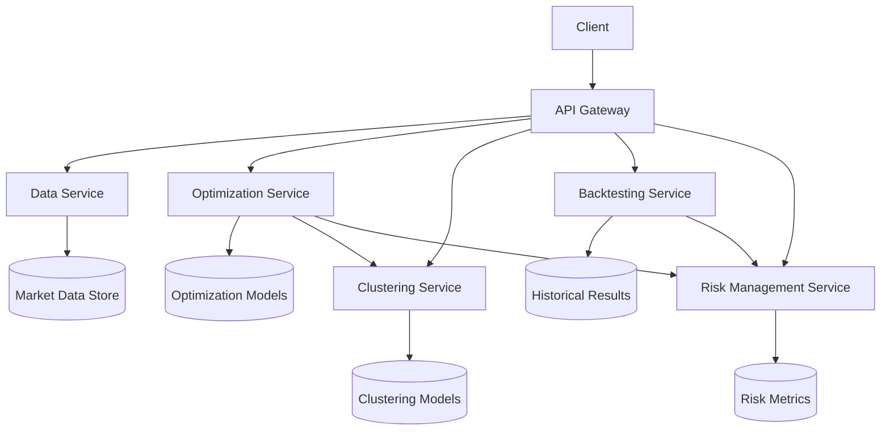

# Portfolio Optimization System Architecture Design

## Microservices Architecture Overview



## Component Specifications

### 1. Data Service
- Responsibilities:
  - Data ingestion from multiple sources (yfinance, investpy, pickled files)
  - Time series alignment and normalization
  - Data validation and cleansing
  - Caching mechanism for frequent queries

### 2. Optimization Service
- Core Functionality:
  - Markowitz optimization
  - Hierarchical Risk Parity (HRP)
  - Monte Carlo simulation
  - Portfolio weight calculation
- Interfaces:
  ```python
  class OptimizationEngine:
    def markowitz_optimize(weights, returns, cov_matrix)
    def hrp_optimize(cov_matrix, linkage_matrix)
    def monte_carlo_simulate(returns, num_simulations)
  ```

### 3. Clustering Service
- Implemented Algorithms:
  - K-means clustering
  - Agglomerative clustering
  - PCA-based clustering
- Features:
  - Dynamic cluster determination
  - Cluster validation metrics
  - Cluster visualization

### 4. Backtesting Service
- Key Components:
  - Historical backtesting framework
  - Walk-forward optimization
  - Transaction cost modeling
  - Performance attribution

### 5. Risk Management Service
- Risk Metrics:
  - Value at Risk (VaR)
  - Conditional VaR (CVaR)
  - Sharpe and Sortino ratios
  - Maximum drawdown calculation
- Features:
  - Risk parity optimization
  - Risk budgeting
  - Stress testing

## Data Flow
1. Client requests portfolio optimization
2. API Gateway routes request to Data Service
3. Data Service provides preprocessed market data
4. Clustering Service groups assets
5. Optimization Service generates portfolio weights
6. Risk Management Service evaluates risk profile
7. Backtesting Service validates performance
8. Results returned to client

## API Contracts
- RESTful API for inter-service communication
- Standardized data formats (JSON with schema validation)
- Error handling strategy:
  - 400-series errors for client issues
  - 500-series errors for service failures
  - Health check endpoints for service discovery