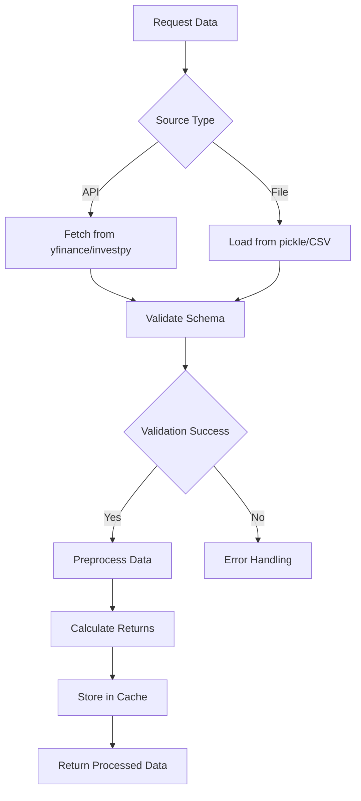

# Market Data Pipeline Design

## Module Structure
```
data_pipeline/
├── __init__.py
├── sources.py          # Data source connectors
├── ingestion.py        # Core ingestion pipeline
├── validation.py       # Data validation rules
├── preprocessing.py    # Data transformation
├── storage.py          # Data persistence
└── models.py           # Data models and schemas
```

## Data Sources
### Supported Sources:
- yfinance (Yahoo Finance API)
- investpy (Investing.com API)
- Pickled files (stocks-data.pkl, market-data.pkl)
- CSV files (historical market data)
- SQL databases (for enterprise deployments)

### Source Interface:
```python
class DataSource(ABC):
    def fetch_historical_data(self, symbols: List[str], 
                            start: str, end: str) -> pd.DataFrame:
        """Fetch historical price data for given symbols"""
    
    def fetch_bond_data(self, symbol: str, 
                        period: str) -> pd.DataFrame:
        """Fetch risk-free rate data"""
    
    def available(self) -> List[str]:
        """List available datasets"""
```

## Ingestion Pipeline
### Core Components:
1. **Data Fetcher** - Source-agnostic data retrieval
2. **Time Series Aligner** - Date range normalization
3. **Missing Data Handler** - Imputation and filtering
4. **Return Calculator** - Log returns and volatility

### Ingestion Workflow:


## Data Validation
### Validation Rules:
- Date range validation
- Price bounds validation (positive values)
- Missing values threshold (max 5% missing)
- Data type validation
- Column schema validation

### Validation Output:
```python
class DataValidationResult:
    def __init__(self, valid: bool, 
                 missing_stats: Dict, 
                 schema_errors: List[str],
                 value_errors: List[str]):
        # Implementation details
```

## Preprocessing
### Implemented Transformations:
- Log return calculation
- Z-score normalization
- Exponential weighting
- Outlier clipping (3σ)
- Missing value imputation (forward fill)

### Preprocessing Pipeline:
```python
class DataPreprocessor:
    def __init__(self, exponential_weight: float = 0.94):
        self.weight = exponential_weight
    
    def calculate_returns(self, prices: pd.DataFrame) -> pd.DataFrame:
        """Calculate log returns with optional exponential weighting"""
    
    def normalize(self, returns: pd.DataFrame) -> pd.DataFrame:
        """Apply Z-score normalization"""
    
    def handle_outliers(self, data: pd.DataFrame) -> pd.DataFrame:
        """Clip extreme values at 3σ"""
```

## Data Storage
### Cache Implementation:
- Local cache (file-based for small datasets)
- Redis integration (for enterprise deployments)
- Versioned storage (to track data lineage)

### Cache Interface:
```python
class DataCache:
    def get(self, key: str) -> Optional[pd.DataFrame]:
        """Retrieve data from cache"""
    
    def set(self, key: str, data: pd.DataFrame):
        """Store data in cache with versioning"""
    
    def clear(self):
        """Clear cache for specific dataset"""
```

## Error Handling Strategy
- Source-specific error types (APIError, FileError)
- Data validation exceptions
- Graceful degradation for missing data
- Comprehensive error context (source, dataset, error type)
- Retry mechanism for API calls

## Integration Points
- Optimization Service: Returns and covariance matrices
- Risk Management: Volatility and correlation data
- Clustering Service: Feature normalization
- Backtesting: Historical data for walk-forward analysis